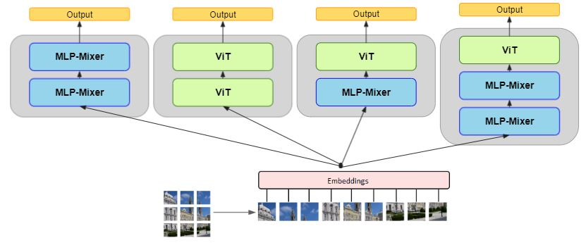
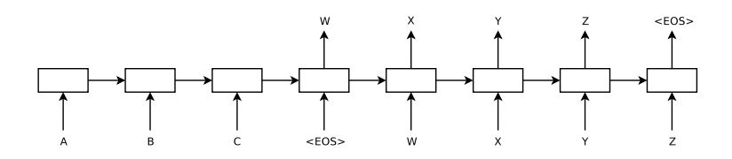
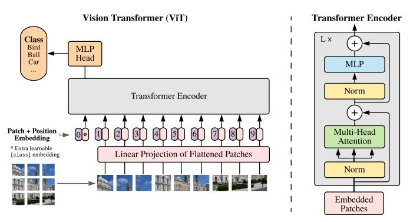
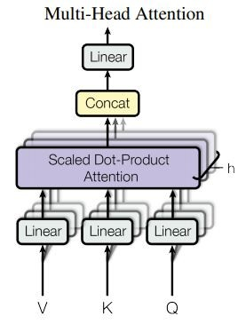
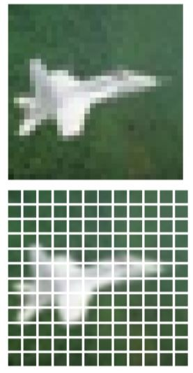
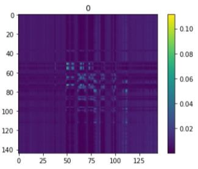
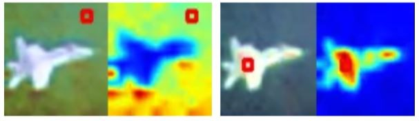
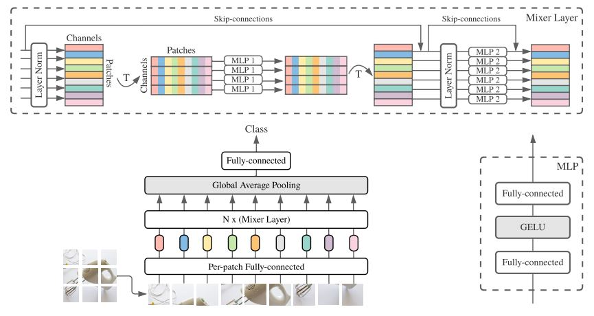
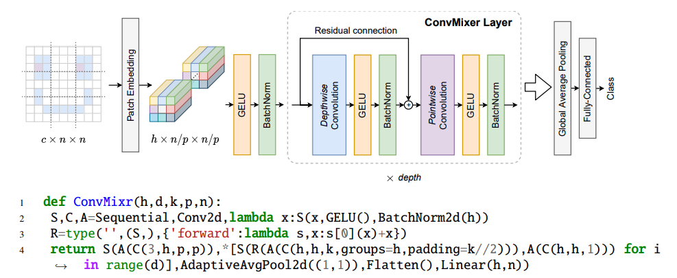

# Transformers
<!--  -->

1. Introduction
2. ViT: Transformers for Computer Vision 
3. Visualizing the attention   
4. MLP-Mixer   
5. Hybrid MLP-Mixer + ViT   
6. ConvMixer and Hybrid ConvMixer + MLP-Mixer   

---

## 1) Introduction

### What is wrong with RNNs and CNNs
Learning Representations of Variable Length Data is a basic building block of sequence-to-sequence learning for Neural machine translation, summarization, etc
- **Recurrent Neural Networks (RNNs)** are natural fit variable-length sentences and sequences of pixels. But sequential computation inhibits parallelization. No explicit modeling of long and short-range dependencies.
- **Convolutional Neural Networks (CNNs)** are trivial to parallelize (per layer) and exploit local dependencies. However, long-distance dependencies require many layers.

### Attention!
The Transformer archeticture was proposed in the paper [Attention is All You Need](https://arxiv.org/abs/1706.03762). As mentioned in the paper: 
> "_We propose a new simple network architecture, the Transformer, based solely on attention mechanisms, dispensing with recurrence and convolutions entirely_"

> "_Experiments on two machine translation tasks show these models to be superior in quality while being more parallelizable and requiring significantly less time to train_"

Machine Translation (MT) is the task of translating a sentence x from one language (the source language) to a sentence y in another language (the target language). One basic and well known neural network architecture for NMT is called sequence-to-sequence [seq2seq](https://arxiv.org/pdf/1409.3215v3.pdf) and it involves two RNNs.
- **Encoder**: RNN network that encodes the input sequence to a single vector (sentence encoding)
- **Decoder**: RNN network that generates the output sequences conditioned on the encoder's output. (conditioned language model)

The problem of the vanilla seq2seq is information **bottleneck**, where the encoding of the source sentence needs to capture all information about it in one vector.

As mentioned in the paper [Neural Machine Translation by Jointly Learning to Align and Translate](https://arxiv.org/pdf/1409.0473.pdf) 
> "_A potential issue with this encoder–decoder approach is that a neural network needs to be able to compress all the necessary information of a source sentence into a fixed-length vector. This may make it difficult for the neural network to cope with long sentences, especially those that are longer than the sentences in the training corpus._"

**Attention provides a solution to the bottleneck problem**
- **Core idea**: on each step of the decoder, use a direct connection to the encoder to focus on a particular part of the source sequence.
Attention is basically a technique to compute a **weighted sum** of the values (in the encoder), dependent on another value (in the decoder).

The main idea of attention can be summarized as mention the OpenAi's [article](https://openai.com/blog/sparse-transformer/):
> "_... every output element is connected to every input element, and the weightings between them are **dynamically calculated based upon the circumstances**, a process called attention._"

### Query and Values

- In the seq2seq + attention model, each decoder hidden state (query) attends to all the encoder hidden states (values)
- The weighted sum is a **selective summary** of the information contained in the values, where the query determines which values to focus on.
- Attention is a way to obtain a fixed-size representation of an arbitrary set of representations (the values), dependent on some other representation (the query).

---

## 2) Transformers for Computer Vision 
Transfomer based architectures were used not only for NLP but also for computer vision tasks. One important example is Vision Transformer [ViT](https://arxiv.org/pdf/2010.11929.pdf) that represents a direct application of Transformers to image classification, without any image-specific inductive biases. As mentioned in the paper:
> "_We show that reliance on CNNs is not necessary and a pure transformer applied directly to sequences of image patches can perform very well on image classification tasks_" 

> "_Vision Transformer (ViT) attains excellent results compared to state-of-the-art convolutional networks_"

As we see, an input image is splitted into **patches** which are treated the same way as tokens (words) in an NLP application. **Position embeddings** are added to the patch embeddings to retain positional information. Similar to BERT’s **class token**, a classification head is attached here and used during pre-training and fine-tuning. The model is trained on image classification in supervised fashion.

## Multi-head attention
The intuition is similar to have a multi-filter in CNNs. Here we can have multi-head attention, to give the network more capacity and ability to learn different attention patterns. By having multiple different layers that generate (or project) the vectors of queries, keys and values, we can learn multiple representations of these queries, keys and values.

Where each token is projected (in a learnable way) into three vecrors Q, K, and V:
- **Q**: Query vector: What I want
- **K**: Key vector: What type of info I have
- **V**: Value vector: What actual info I have

---

## 3) Visualizing the attention

The basic ViT architecture is used, however with only one transformer layer with one (or four) head(s) for simplicity. The model is trained on CIFAR-10 classification task. The image is splitted in to 12 x 12 = 144 patches as usual, and after training, we can see the 144 x 144 attention scores (where each patch can attend to the others).

**Attention map** represents the correlation (attention) between all the tokens, where the sum of each row equals 1 representing the probability distribution of attention from a query patch to all others.

**Long distance attention** we can see two interesting patterns where background patch attends to long distance other background patches, and this flight patch attends to long distance other flight patches.

We can try more heads and more transfomer layers and inspect the attention patterns.

---

## 4) MLP-Mixer

**MLP-Mixer** is proposed in the paper [An all-MLP Architecture for Vision](https://arxiv.org/pdf/2105.01601.pdf). As mentioned in the paper:
> "_While convolutions and attention are both sufficient for good performance, neither of them is necessary!_"

> "Mixer is a competitive but conceptually and technically simple alternative, that does not use convolutions or self-attention"

Mixer accepts a sequence of linearly projected image patches (tokens) shaped as a “patches  × channels” table as an input, and maintains this dimensionality. Mixer makes use of two types of MLP layers: 

- **Channel-mixing MLPs** allow communication between different channels, they operate on each token independently and take individual rows of the table as inputs 
- **Token-mixing MLPs** allow communication between different spatial locations (tokens); they operate on each channel independently and take individual columns of the table as inputs.

These two types of layers are interleaved to enable interaction of both input dimensions.

> "_The computational complexity of the network is linear in the number of input patches, unlike ViT whose complexity is quadratic_"

> "_Unlike ViTs, Mixer does not use position embeddings_"

It is commonly observed that the first layers of CNNs tend to learn detectors that act on pixels in **local regions** of the image. In contrast, Mixer allows for **global information exchange** in the token-mixing MLPs. 

> "_Recall that the token-mixing MLPs allow global communication between different spatial locations._" 

The figure shows hidden units of the four token-mixing MLPs of Mixer trained on CIFAR10 dataset. 

---

## 5) Hybrid MLP-Mixer and ViT

We can use both the MLP-Mixer and ViT in one network architecture to get the best of both worlds.

 

 Adding a few self-attention sublayers to mixer is expected to offer a simple way to trade off speed for accuracy.  

---

## 6) Hybrid MLP-Mixer and CovMixer

 [Patches Are All You Need?](https://arxiv.org/abs/1706.03762)

> Is the performance of ViTs due to the inherently more powerful Transformer architecture, or is it at least partly due to using patches as the input representation.

> ConvMixer, an extremely simple model that is similar in many aspects to the ViT and the even-more-basic MLP-Mixer

> Despite its simplicity, ConvMixer outperforms the ViT, MLP-Mixer, and some of their variants for similar parameter counts and data set sizes, in addition to outperforming classical vision models such as the ResNet.

> While self-attention and MLPs are theoretically more flexible, allowing for large receptive fields and content-aware behavior, the inductive bias of convolution is well-suited to vision tasks and leads to high data efficiency.

> ConvMixers are substantially slower at inference than the competitors!

 

We can use both the MLP-Mixer and ConvMixer in one network architecture to get the best of both worlds.

---

## References and more information
- Article [Transformers without pain](https://www.linkedin.com/pulse/transformers-without-pain-ibrahim-sobh-phd/)
- Article [Attention for Neural Machine Translation (NMT) without pain](https://www.linkedin.com/pulse/attention-neural-machine-translation-nmt-without-pain-sobh-phd/)
- Article [Anatomy of the Beast with many heads](https://www.linkedin.com/pulse/anatomy-beast-many-heads-code-ibrahim-sobh-phd/)
- Article [MLP is all you need](https://www.linkedin.com/pulse/mlp-all-you-need-code-ibrahim-sobh-phd)
- Article [Patches Are All You Need](https://www.linkedin.com/pulse/patches-all-you-need-code-ibrahim-sobh-phd/)
- [CS224n: Natural Language Processing with Deep Learning Stanford / Winter 2019](https://web.stanford.edu/class/archive/cs/cs224n/cs224n.1194/)
- [Natural Language Processing with Deep Learning (Winter 2017)](https://www.youtube.com/playlist?list=PL3FW7Lu3i5Jsnh1rnUwq_TcylNr7EkRe6)
- [Neural Machine Translation (seq2seq) Tutorial](https://github.com/tensorflow/nmt)
